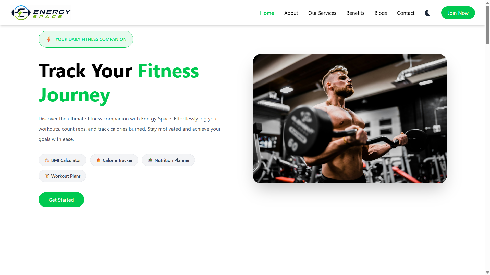
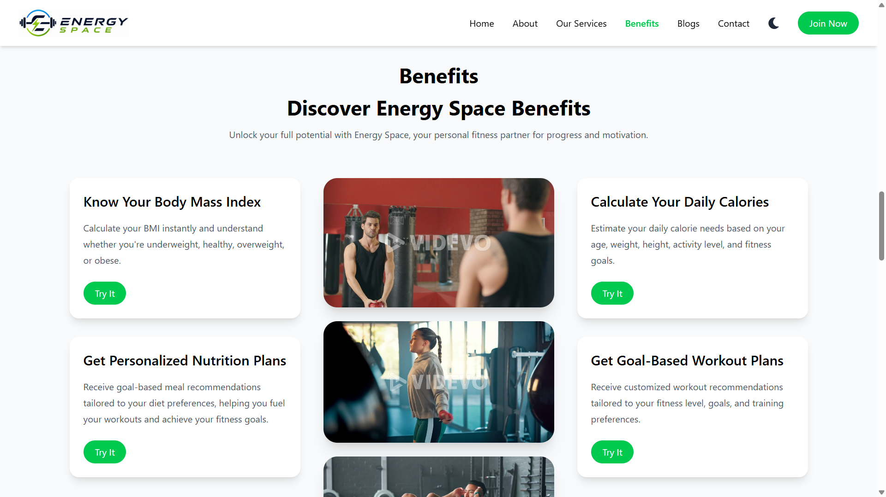
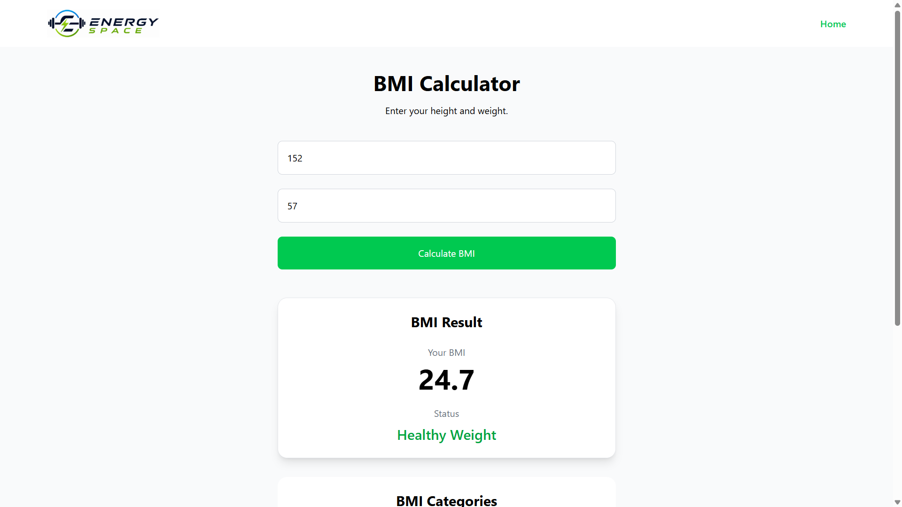
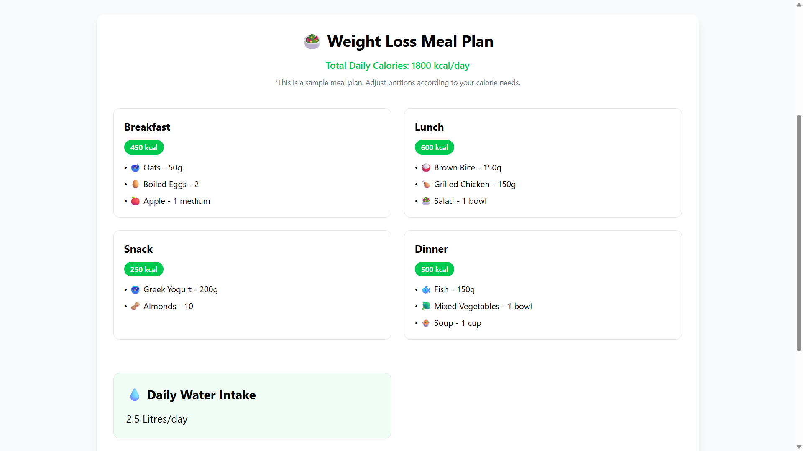
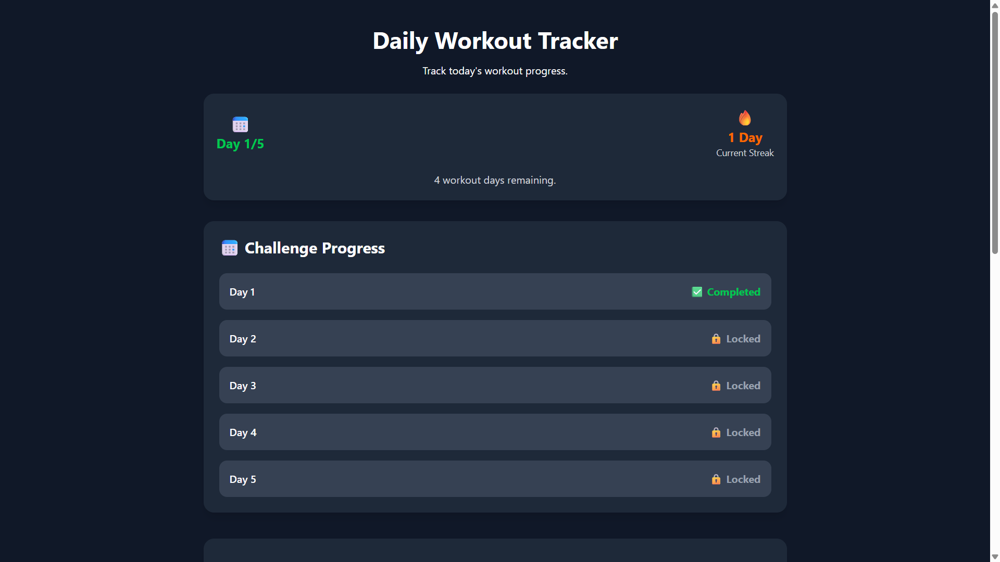
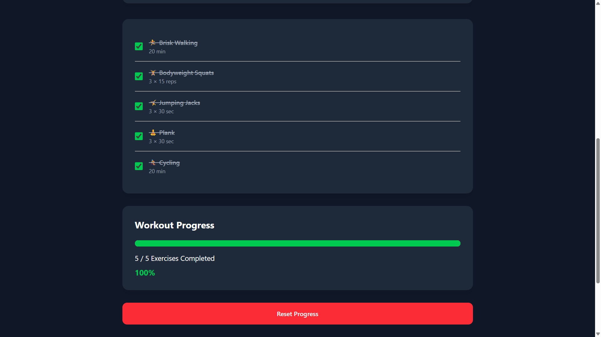

[](https://energy-space.vercel.app/)

# ⚡ Energy Space

Energy Space is a modern fitness web application built with React.js that helps users achieve their fitness goals through personalized tools and workout tracking.

## 🚀 Live Demo

🌐 https://energy-space.vercel.app/

## 💻 GitHub Repository

https://github.com/ashmapathan/energy-space

---

## ✨ Features

- 🏋️ Goal-Based Workout Planner
- ⚖️ BMI Calculator
- 🔥 Daily Calorie Calculator
- 🥗 Personalized Nutrition Planner
- 📅 5-Day Workout Challenge
- 🔥 Workout Streak Tracking
- 🌙 Dark / Light Mode
- 📱 Fully Responsive Design

---

## 🛠️ Tech Stack

- React.js
- Vite
- Tailwind CSS
- React Router DOM
- JavaScript
- Local Storage

---

# 📸 Screenshots

## 🏠 Home Page



---

## 💪 Benefits Section



---

## ⚖️ BMI Calculator



---

## 🥗 Nutrition Planner



---
## 📅 Workout Challenge Progress



---

## 💪 Workout Progress & Summary


---

## 📦 Installation

```bash
git clone https://github.com/ashmapathan/energy-space.git

cd energy-space

npm install

npm run dev
```

---

## 👩‍💻 Author

**Ashma Begum Pathan**

LinkedIn: www.linkedin.com/in/pathanashmabegum

GitHub: https://github.com/ashmapathan